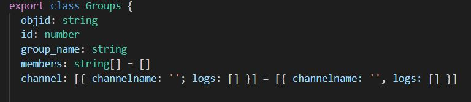
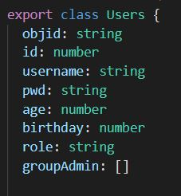
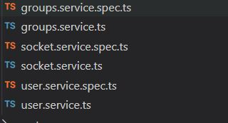
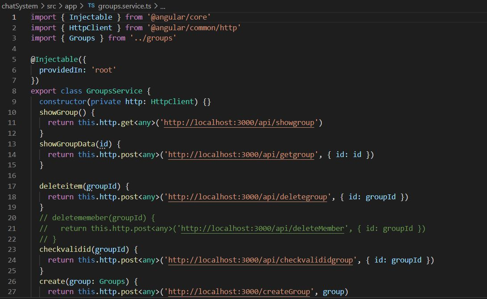
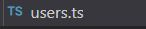
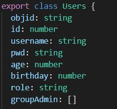
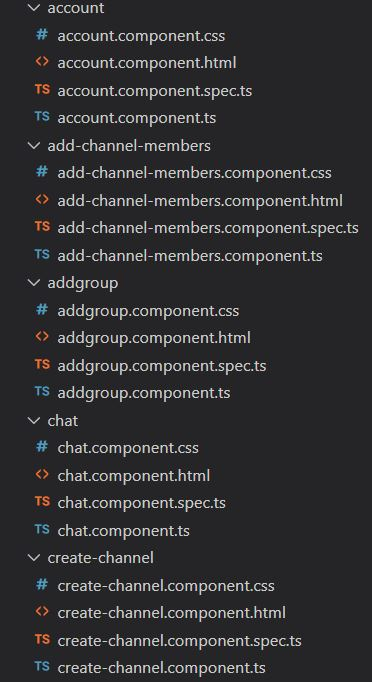
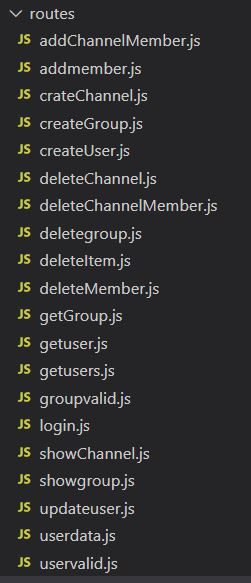

# ChatroomAssignmnet

This project was generated with [Angular CLI](https://github.com/angular/angular-cli) version 8.2.2.

## Git Layout
 Chatsystem Consists of mainly three folders namely: node modules, server and src. "node_modules" is automatically generated which consists of all the required node modules. Sever fold consists of server side code which involves routes,server.js and socket.js. Whereas, src holds the angular code which is basically a client side code.

 ## Data Structures
 Data Structures are a specialized means of organizing and storing data in computers in such a way that we can perform operations on the stored data more efficiently. In this assignment we mainly have two data structure's namely group data structure and user data structure. In group data structure we have different fields of data like objid, id, group_name, members, channel,and channelname. The code snippet given below portrays the data structure's.

   
 
 
## Angular Architecture

### Services

For data or logic that isn't associated with a specific view, and that we want to share across components, we create a service class. A service class definition is immediately preceded by the @Injectable() decorator as shown in figure given below. The decorator provides the metadata that allows other providers to be injected as dependencies into our class.

 

### Models

This file(user.ts) is model file.  

where we created a very simple models for Users.

 

### Components

Components are the main building block for Angular applications. Each component consists of:

* An HTML template that declares what renders on the page
* A Typescript class that defines behavior
A CSS selector that defines how the component is used in a template
* Optionally, CSS styles applied to the template

 

## Rest API

### Routes

Routing refers to how an application’s endpoints (URIs) respond to client requests. 

 

* addChannelMember route adds channel members
* addmember route adds member
* createChannel route creates  the channel
* createGroup route creates the Group
* createUser route creates the user
* deleteChannel route delete's the channel
* deleteChannelMember route delete's the channel member
* deletegroup route delete's the group
* deleteItem route delete's the item
* deleteMember route delete's the member
* getGroup route retrieve/get the group
* getuser route retrive/get the user
* getusers route retrieve/get users
* groupvalid route validate the group
* login route redirects to login
* showChannel route show the channel
* showgroup route show the group
* updateuser route update the user
* userdata route get the user data
* uservalid route validate the user 

### Parameters

Route parameters are named URL segments that are used to capture the values specified at their position in the URL. The captured values are populated in the req.params object, with the name of the route parameter specified in the path as their respective keys.

"object id"show in the snippet below is the parameter to the routes, it might be the object id for user, usergroup, channel or any other class.

### Return Values

json strings or array are the return value from these routes when parameters are passed. Forexample is objectid of any user is passed to the route then the requested detailed associated with that objectid will be retrieved in form of json string ore array and portrayed on the web.